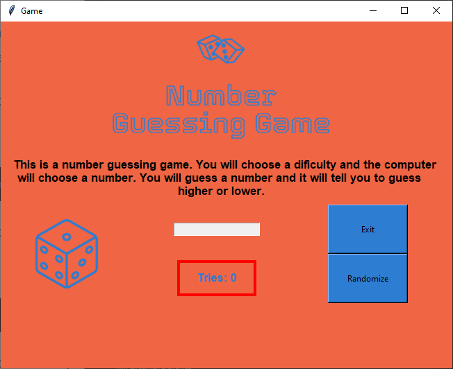

# 🎲 Number Guessing Game – Tkinter Edition

A fun and interactive **Number Guessing Game** built with Python and **Tkinter**. Users try to guess a randomly generated number between 0 and 100 with hints provided through visual feedback (higher/lower/correct).



---

## 🎮 Features

- ✅ Clean, colorful GUI using `Tkinter`
- 🎯 Visual hints for guessing too high or low
- 🎲 Randomized number generation with animated "thinking..." phase
- 📉 Tries counter with color-coded warnings
- 🧠 Keyboard interaction (Enter to submit, typing limited to digits)
- 🚪 Exit button and in-app reset upon success

---

## 🖥️ How to Play

1. Click **"Randomize"** to start.
2. After a short animation, the input box will become active.
3. Enter a number between 0–100 and press `Enter`.
4. Based on your guess, the app will:
   - Show an **up arrow** if the number is higher
   - Show a **down arrow** if the number is lower
   - Show a **checkmark** and reset if correct
5. You have 8 tries. The border color of the tries label changes as you approach the limit.

---

## 📦 Assets Required

Ensure the following image files exist inside an `assets/` folder in the same directory as the script:

```
assets/
├── correct.png       # Displayed when the guess is correct
├── dice.png          # Initial/default image
├── down.png          # Displayed if the guess is too high
├── up.png            # Displayed if the guess is too low
├── dots1.png         # Thinking animation (frame 1)
├── dots2.png         # Thinking animation (frame 2)
├── dots3.png         # Thinking animation (frame 3)
└── logo.png          # Game title/logo
```

---

## 📐 Interface Overview

| Element        | Function                          |
|----------------|-----------------------------------|
| 🎲 Dice Image   | Shows state (thinking, hint, win) |
| 🎯 Input Box    | Enter your guess (digits only)     |
| 🔢 Tries Label  | Shows remaining attempts           |
| 🎛️ Buttons      | Randomize / Exit the game          |
| ⌛ Animation     | Adds anticipation before number is set |

---

## 🧰 Requirements

- Python 3.6+
- Tkinter (built-in with Python)

---

## 🚀 Run the Game

```bash
python guessing_game.py
```

Make sure the `assets/` folder with the required images is in the same directory.

---

## 🔐 Input Handling

- Only digits (0–9) are accepted in the input box.
- Game disables input until it's ready.
- Guessing resets after correct answer or 8 tries.

---

## 👨‍💻 Author

[Oliver](https://github.com/jollyolliel/)

---

